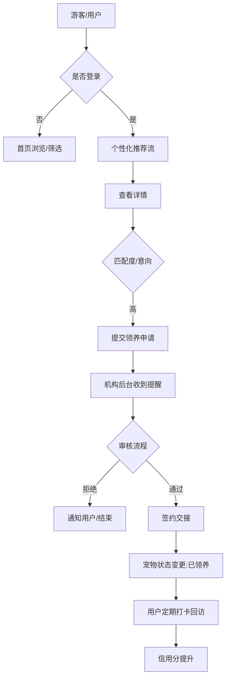

这是一个非常完整且逻辑清晰的系统设计。基于你提供的功能需求和数据库结构，我为你梳理了一套**原型图设计方案**。

### 一、 用户端（领养人 - 响应式/H5优先）

用户端设计应强调“温暖、透明、便捷”，突出宠物照片和匹配度。

#### 1. 首页 (Discovery)
*   **顶部栏**：左侧定位（腾讯LBS定位城市），中间搜索框（搜品种、机构），右侧消息通知。
*   **金刚区（分类）**：猫猫、狗狗、其他、附近领养、急寻领养。
*   **推荐流（核心）**：
    *   **卡片设计**：左/上为宠物大图，右/下为简要信息（名字、性别、年龄、距离）。
    *   **特色标签**：显示“匹配度 95%”或“附近 1.2km”。
    *   **瀑布流布局**：适合展示大量宠物图片。

#### 2. 宠物详情页 (Pet Detail)
*   **头部**：多图/视频轮播，右上角收藏按钮。
*   **核心信息区**：
    *   名字、品种、标签（粘人、已绝育、疫苗齐）。
    *   **智能匹配卡片**：显示“为什么推荐给你”（基于用户偏好：如“符合您对小型犬的偏好”）。
*   **详情介绍**：健康状况、性格描述、领养要求。
*   **机构卡片**：机构名称、信用等级、地址（点击调起地图）。
*   **底部操作栏**：[咨询机构] [发起领养申请]。

#### 3. 领养申请表 (Application Form)
*   **步骤条**：1.基本资料 -> 2.问卷调研 -> 3.材料上传。
*   **问卷内容**：居住环境（自有/租房）、是否有经验、是否接受家访等。
*   **交互**：采用 Element Plus 的分步表单。

#### 4. 个人中心 (User Center)
*   **信用看板**：展示信用分、等级（如：初级领养人）、获得的徽章。
*   **功能矩阵**：我的申请（带状态红点）、我的收藏、领养后打卡（发布动态）、偏好设置（滑动条选择年龄区间、勾选标签）。

---

### 二、 机构端（后台管理界面）

机构端侧重于“效率、流转、管理”。

#### 1. 工作台 (Dashboard)
*   **数据概览**：待审核申请、在养宠物数、本月领养成功数。
*   **待办提醒**：哪些申请已超过24小时未处理，哪些领养人该回访了。

#### 2. 宠物档案管理 (Pet Management)
*   **列表页**：展示状态（草稿、发布中、领养中、已领养）。
*   **发布/编辑页**：
    *   基础信息录入。
    *   **多媒体上传**：支持拖拽上传照片/视频。
    *   **坐标拾取**：集成腾讯地图插件，点击地图自动获取经纬度。

#### 3. 领养申请审批 (Review Process)
*   **看板视图**：类似 Trello，将申请分为“初审、面谈、家访、签约”。
*   **审批详情**：
    *   左侧展示领养人填写的问卷。
    *   右侧展示领养人的信用历史（是否有黑名单嫌疑）。
    *   底部：[拒绝-填写原因] [通过-转入下一阶段]。

---

### 三、 管理员端（平台运营）

#### 1. 审核中心
*   **机构准入审核**：查看机构上传的资质证明。
*   **内容巡检**：违规图片/敏感词自动预警，人工下架。

#### 2. 运营配置
*   **权重调整**：滑动条调整 α (匹配分)、β (距离分)、γ (新鲜度) 的权重比例。
*   **标签库管理**：添加/删除系统全局标签。

---

### 四、 核心交互逻辑原型图（思维导图版）

你可以根据这个逻辑连接页面：

---

### 五、 设计细节建议 (UI/UX)

1.  **色彩规范**：
    *   主色：`#FF8C42` (暖橙色 - 亲和力)。
    *   辅助色：`#67C23A` (薄荷绿 - 健康/生命力)。
2.  **组件库**：
    *   既然你使用 **Vue3 + Element Plus**，原型设计时直接参考 Element Plus 的组件（如 `el-card`, `el-steps`, `el-tag`），这样前端实现时还原度最高。
3.  **LBS 视觉体现**：
    *   在宠物卡片上增加一个“小地图图标”或“距离当前位置 X.X km”，增加真实感。
4.  **智能匹配可视化**：
    *   不要只给一个分数，建议用雷达图或简单的进度条显示：性格契合度、环境匹配度、经验吻合度。

### 六、 下一步操作建议

1.  **低保真原型**：先用纸笔或白板画出“首页”和“申请流程”的草图。
2.  **高保真原型工具**：
    *   如果你擅长代码，可以直接用 **Vue3 + Element Plus** 撸一个 Mock 版本的 UI，这就是最真实的“原型”。
    *   如果你需要演示给他人，使用 **墨刀 (Mockitt)** 或 **Figma**，它们有很多现成的“宠物/社交类”模板可以套用。

